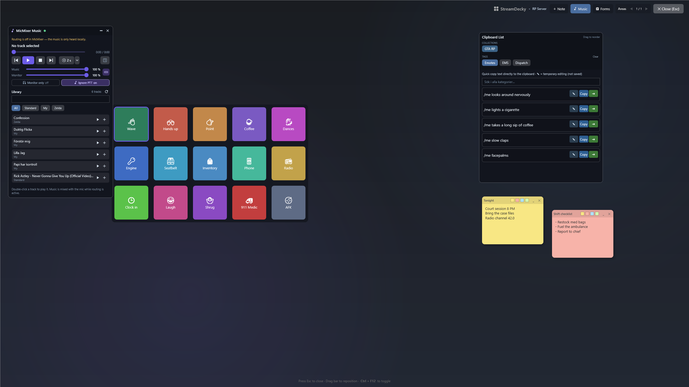

# StreamDecky

StreamDecky is a software command deck for Windows. Press a global hotkey (or a
gamepad combo) and a fullscreen overlay opens on top of your game: a grid of
macro buttons, ready-made chat lines, fill-in forms, and sticky notes. Click
something and StreamDecky hands focus back to the game and sends the keystrokes
or text there. No Stream Deck hardware needed — it's all software.

[**Download for Windows**](https://github.com/benjibutten/StreamDecky/releases/latest)
· Windows 10/11 · self-contained, no .NET install · runs without admin · Apache-2.0



## What it's for

- **Roleplay servers like FiveM.** Fire emotes and animations from one-press
  buttons (`open chat → /e dance → Enter`), keep your `/me` and `/do` lines in a
  searchable quick-text panel, and pin radio channels or plates as sticky notes
  over the game.
- **Repeated paperwork.** Build a form once — text fields, choice fields,
  auto-incrementing case or invoice numbers, `{date}`/`{time}` tokens — and fill
  it from the overlay into a dispatch report or a real-world canned reply.
- **Hotkey and gamepad control.** Open the overlay with a global hotkey or a
  recorded gamepad combo, and navigate it with the D-pad or stick when you don't
  want to reach for the keyboard.

## Quick setup

1. Download and extract the latest Windows ZIP.
2. Run `StreamDecky.exe` and build a deck in the editor.
3. Set the overlay hotkey in **Settings**, then open the overlay over your game.
4. Optionally import one of the ready-made profiles below via **Settings →
   Import Profile**. It is added next to your own profiles, never over them.

## Trust at a glance

- Official releases are built by GitHub Actions from the tagged source commit.
- Releases since `v2026.7.5` include a `.sha256` file for the Windows archive.
- The current Windows release is **unsigned**. Check the release notes for its
  authoritative signing status and see the [code signing policy](https://benjibutten.github.io/StreamDecky/code-signing-policy.html).

## Templates and guides

- **Ready-made profiles** you can import and adapt:
  [FiveM Roleplay](docs/templates/fivem-roleplay.json) and
  [Canned Replies](docs/templates/canned-replies.json). See
  [docs/templates](docs/templates/README.md) for what's inside and how to import.
- **Guide:** [Build a FiveM roleplay deck](docs/guides/fivem-roleplay-deck.md).

The rest of this document is the detailed reference.

## Requirements

- Windows 10 or Windows 11
- `.NET 10 SDK` for local development
- A writable `%LOCALAPPDATA%\StreamDecky` folder for profiles, backups, and logs
- A stable install path if you plan to use `Start with Windows`

Published releases are self-contained `win-x64` builds, so end users do not need a separate .NET runtime installation.

## Highlights

### Overlay and focus

- Full-screen topmost overlay (`OverlayWindow`)
- Close with `Esc` or the close button
- Attempts to regain focus if the overlay loses it unexpectedly
- Restores focus to the previous foreground window before executing actions

### Single instance and startup

- Runs as a single-instance app
- A second launch activates the existing window instead of starting a second process
- Supports `--minimized` to start hidden in the tray
- `Start with Windows` writes `"<path to exe>" --minimized` to `HKCU\SOFTWARE\Microsoft\Windows\CurrentVersion\Run`

### Tray and main window

- Creates a tray icon with `Show` and `Exit`
- Closing the main window hides it to the tray instead of exiting the process
- Loads the tray icon from the executable icon with a Windows application icon fallback

### Button actions

- `TextInput`
  - Clipboard paste mode or simulated typing
  - Optional `Enter` after text input
- `KeyPress`
  - SendKeys-style key strings with modifiers and special keys
- `MultiAction`
  - Ordered action steps: `KeyPress`, `TextInput`, and `Delay`
- `LayoutNavigation`
  - Jumps directly to another page or virtual layout

### Layouts, notes, and profiles

- Regular pages with previous/next navigation
- Virtual layouts for hidden menus and direct navigation targets
- Shared layout size (`Rows` and `Columns`) across layouts in a profile
- Page-independent sticky notes stored in dedicated note pages
- Multiple profiles with separate layouts, notes, quick text, and overlay/input settings
- Export the active profile from Settings; import adds the file as a new profile
  (renamed if the name is taken) and switches to it, leaving existing profiles untouched

### Quick clipboard text

- Profile-scoped quick text items and categories
- Overlay search/filter support
- Shared multi-step action pipeline for clipboard rows
- Session-only inline edits in the overlay without autosaving temporary changes

### Forms

- Profile-scoped fill-in forms designed in the editor and filled in from the overlay
- Field types: free text (single- or multiline) and choice fields where selecting an option prefills an editable text
- Per-field autocomplete suggestions from previously submitted values (opt-in per field)
- Optional shared suggestion keys let explicitly selected fields reuse autocomplete values across forms without sharing submissions or other field data
- Optional required-field validation that blocks submission until required values are filled in
- Auto-incrementing counters (e.g. invoice numbers) with optional zero padding; counters increment once per submission
- Output composed from a template with `{field}`, Choice option-title `{field_choice}`, `{counter}`, and built-in `{date}`, `{time}`, `{datetime}` tokens, with live preview in both editor and overlay
- Submit to clipboard, or through an optional per-form action-step pipeline against the previously focused window
- Submission history stored outside the profile with view, copy, and delete in the editor
- Clearing form history also clears autocomplete suggestion data, including orphaned suggestions
- Draggable, resizable overlay panel persisted per profile

### Text helper widget

- Optional overlay widget (`Text` in the overlay top bar) with a roomy, dyslexia-friendly writing box: pick any installed font (Verdana by default) and text size in **Settings**
- Two looks for the writing area, switchable in **Settings**: a warm off-white that glares less than pure white (default, and easier for most people with dyslexia), or a dark one that matches the overlay theme
- **Fix spelling** — or `Ctrl+Enter` in the box — replaces what you wrote with a respelled version from DeepSeek, keeping your language, wording, and any `/commands`; `Enter` on its own still inserts a newline, and **Undo** brings your own words straight back
- **Copy** always copies the box as it stands, whether or not the spell fix has run
- Needs a DeepSeek API key in **Settings**, where the model, the correction prompt, and how much the model reasons can also be changed; the key is stored scrambled for your Windows account and never travels with a profile export
- Reasoning is requested **off** by default. DeepSeek otherwise thinks at `high` effort on every call, which costs seconds and tokens that respelling a chat line does not need; raise it in **Settings** only if corrections come back wrong
- The writing box takes the caret as soon as the widget appears, and its text survives closing and reopening the overlay
- Draggable, resizable from both bottom corners, and persisted per profile

### MicMixer music widget

- Optional overlay widget (`Music` in the overlay top bar) that remote-controls MicMixer's built-in music player
- Transport controls, seek, music/monitor volume, and a volume-link toggle synced with MicMixer
- Delayed start with a configurable countdown that plays the track marked in the list, plus single-track mode
- Library browsing with search, per-folder filter chips, click-to-mark and play/enqueue per track, and a reorderable queue
- Compact mode hides the queue and library, keeping only the player controls
- Draggable, resizable from both bottom corners, and persisted per profile; reconnects automatically when MicMixer is not running

### Gamepad support

- Optional per-profile XInput support
- Recordable gamepad combo for toggling the overlay
- D-pad and left stick navigation in the overlay
- `A` activates the selected button, `LB` and `RB` switch pages

## Keyboard shortcuts

In the main window, when a text field is not focused:

- `Delete`: clear the selected button
- Drag a configured button onto another slot to move it, or hold `Ctrl` while dragging to copy it; occupied slots ask before replacement
- `Ctrl+C`: copy the selected button configuration
- `Ctrl+V`: paste onto the selected button

In the overlay:

- `Esc`: close the overlay
- `Ctrl+Enter` in the text helper's writing box: fix the spelling (plain `Enter` inserts a newline)

## Installation

1. Download the latest release zip.
2. Extract it to a stable folder, for example `%LOCALAPPDATA%\Programs\StreamDecky` or another folder you control.
3. Run `StreamDecky.exe`.
4. If you want background startup, enable `Start with Windows` from Settings after the app is running from its final location.

Keeping the same install path helps Windows preserve tray icon preferences and keeps the startup registry entry valid.

Alternatively, install StreamDecky with Windows Package Manager:

```powershell
winget install --id BenjiButten.StreamDecky --exact
```

StreamDecky is distributed outside Microsoft Store. Windows Defender SmartScreen
may show **Windows protected your PC** for an unsigned or newly published build.
Verify that the archive came from the official GitHub release and compare its
SHA-256 hash with the attached `.sha256` file before selecting **More info → Run
anyway**. Windows 11 Smart App Control is a separate feature and may block unknown
unsigned apps without offering that override. See [INSTALLATION.txt](INSTALLATION.txt)
for verification commands and details.

Release builds check GitHub for updates at most once every 12 hours while the
main window is open. When a newer version is available, StreamDecky can download,
verify, install, and restart itself. A manual check is available from
**About → Check for updates**. Installs in protected folders may trigger a UAC
prompt, and Windows may show a security warning when a new build restarts.
Installations made through winget are updated through winget instead of the
built-in updater. Development builds do not perform update checks.

## Code signing and privacy

Current releases are unsigned. Each release states its actual signing status.

See the [code signing policy](https://benjibutten.github.io/StreamDecky/code-signing-policy.html)
for the signing scope, project roles, and build provenance. StreamDecky's
automatic update checks, local profile and form data, simulated input, and
MicMixer integration are covered by the
[privacy policy](https://benjibutten.github.io/StreamDecky/privacy.html).

## Data storage and recovery

- Primary store: `%LOCALAPPDATA%\StreamDecky\profiles.json`
- One-version-back backup: `%LOCALAPPDATA%\StreamDecky\profiles.backup.json`
- Legacy import source: `%LOCALAPPDATA%\StreamDecky\profile.json`
- Form submissions and autocomplete history: `%LOCALAPPDATA%\StreamDecky\form-data.json` (kept outside the profile store so submissions never churn profile backups and personal history stays out of profile exports)
- Machine-wide settings, including the DeepSeek API key, model, thinking level, and spell-fix prompt: `%LOCALAPPDATA%\StreamDecky\app-settings.json` (kept outside the profile store so the key is never included in a profile export; the key itself is protected with Windows DPAPI for your user account, so copying the file to another account or machine will not reveal it)
- Diagnostics log: `%LOCALAPPDATA%\StreamDecky\logs\streamdecky.log`

Profile data is autosaved after real data mutations and can also be saved through explicit save flows.

The profile format uses explicit schema versions and versioned migrations. If StreamDecky opens data created by a newer app version, it will load that data without migration but block saving to avoid overwriting fields from a newer schema.

Recovery guidance, startup troubleshooting, and import/export recovery flows are documented in [docs/recovery-and-troubleshooting.md](docs/recovery-and-troubleshooting.md).

## Runtime target

The project currently stays on `net10.0-windows`.

The reasoning and release criteria for any future target change are documented in [docs/runtime-target-assessment.md](docs/runtime-target-assessment.md).

## Architecture overview

```text
StreamDecky/
|-- Models/
|   |-- DeckProfile, DeckProfileStore, DeckPage, NotePage, StickyNote
|   |-- ButtonConfig, ActionStep
|   |-- FormTemplate, FormField, FormFieldOption, FormCounter, FormSubmission, FormDataStore
|   |-- AppSettings
|   `-- enums (ActionType, ActionStepType, TextMode, ButtonShape, FormFieldType, ProfileSchemaVersion)
|-- ViewModels/
|   |-- MainViewModel (+ partials for profiles, layouts, sticky notes, quick text, text helper, and save flow)
|   |-- ButtonViewModel
|   |-- TextHelperWidgetViewModel
|   `-- StickyNoteViewModel
|-- Views/
|   |-- OverlayWindow
|   `-- SettingsWindow
|-- Services/
|   |-- ProfileService
|   |-- ProfileSchemaMigrator
|   |-- FormRenderService
|   |-- FormDataService
|   |-- AppSettingsService
|   |-- DeepSeekSpellCheckService
|   |-- TextInputActionService
|   |-- MultiActionService
|   |-- OverlayWindowController
|   |-- HotkeyRegistrationController
|   `-- StartupRegistrySyncService
|-- Helpers/
|   |-- OverlayInterop
|   |-- InputSimulator
|   |-- OverlayImageCache
|   |-- DataProtection
|   `-- Converters
`-- MainWindow.xaml (+ code-behind)
```

### MicMixer integration

`Integrations/MicMixer` contains a reconnecting, same-user named-pipe client for
MicMixer's built-in music player. It provides typed state, all configured library
folders, folder management, transport, queue, volume, delayed-start, single-track,
source-mode, and download operations. The client does not start MicMixer and has no
UI or profile coupling.

`ViewModels/MusicWidgetViewModel` owns an `IMicMixerClient` for the overlay music
widget. The client is created lazily and `Start()` is only called once the widget is
visible in an open overlay, so sessions that never show the widget pay no pipe cost.
Widget visibility, compact mode, position, and size are persisted per profile.

No extra service or companion process is required. The matching server runs inside
`MicMixer.exe` and the connection remains offline until MicMixer is running for the
same Windows user.

## Run locally

Requirement: Windows with the `.NET 10 SDK` installed.

```powershell
dotnet restore StreamDecky.slnx
dotnet run --project src/StreamDecky/StreamDecky.csproj
```

If WPF design-time build or C# Dev Kit locks generated files such as `App.g.cs` and triggers `MC1000`-style failures, use the safer sequence below instead:

```powershell
dotnet build src/StreamDecky/StreamDecky.csproj -c Debug --disable-build-servers /nr:false
dotnet run --project src/StreamDecky/StreamDecky.csproj --no-build
```

To run the full automated test suite locally:

```powershell
dotnet test tests/StreamDecky.Tests/StreamDecky.Tests.csproj -c Debug --disable-build-servers /nr:false
```

## Publishing

Example self-contained single-file publish for `win-x64`:

```powershell
dotnet publish src/StreamDecky/StreamDecky.csproj \
  -c Release \
  -r win-x64 \
  --self-contained true \
  -p:PublishSingleFile=true \
  -p:IncludeNativeLibrariesForSelfExtract=true \
  -p:EnableCompressionInSingleFile=false \
  -p:PublishReadyToRun=true
```

Single-file icon behavior:

- The executable embeds the app icon via `ApplicationIcon`.
- The taskbar and window use the executable icon directly.
- The tray icon is loaded from the executable icon at runtime.
- No separate `.ico` file needs to ship next to the executable for normal runtime icon behavior.

Release pipeline notes:

- Pushes to `main` only trigger `release.yml` when `src/**` changes.
- `release.yml` restores the complete solution and runs the full test suite before
  publishing anything.
- It injects `Version`, `AssemblyVersion`, `FileVersion`, and
  `InformationalVersion` during publish.
- The local `.csproj` version is a fallback and can be overridden by CI.
- The release workflow signs and verifies the executable when both required PFX
  secrets are configured, and fails if only one secret is present.
- The release tag points to the exact commit that was checked out and built.
- [RELEASE_NOTES.md](RELEASE_NOTES.md) contains the short, hand-written notes.
  The workflow adds version, commit, archive hash, and verified signing status.
- `build.yml` is a manual candidate-build for any selected branch. It runs the
  full restore, test, publish, and packaging flow and uploads ZIP plus SHA-256
  without creating a tag or public release.

Feature branches can be combined on the optional `next` branch when a set of
changes should be tested together before `next` is merged to `main`. Small fixes
can go directly through a feature branch to `main`. Only `main` publishes a
release. Without a trusted signature, Windows SmartScreen may require manual
approval; even a newly signed build can initially lack reputation.

## Known limitations

- Desktop apps cannot intercept system-level flows such as `Ctrl+Alt+Del`, Secure Desktop, or some UAC transitions.
- Some games or applications with aggressive anti-cheat or low-level input filtering may ignore simulated input.
- The overlay is primarily designed around the primary display.

## Security and privileges

- The app runs as `asInvoker`; administrator rights are not required by default.
- `Start with Windows` writes to `HKCU\SOFTWARE\Microsoft\Windows\CurrentVersion\Run`.
- Profiles, backups, and logs stay under `%LOCALAPPDATA%\StreamDecky`.
- The text helper widget is the only feature that sends user content to a third party, and only when the user has entered a DeepSeek API key and presses `Fix spelling`. `Test Key` in Settings sends a built-in sample sentence, never your own text.
- The DeepSeek key is stored DPAPI-protected for the current Windows account and is excluded from profile exports. If Windows cannot protect it, StreamDecky refuses to save it rather than writing it in a reversible form.

## Support and acknowledgements

StreamDecky is built and maintained by BenjiButten and released free of charge
as open-source software. A special thank you goes to
[Pixlexi](https://www.twitch.tv/pixlexi), who has contributed the use cases
behind the app, hands-on testing, and valuable feedback throughout development.

If you enjoy StreamDecky and would like to give something back, please consider
gifting a sub to [Pixlexi](https://www.twitch.tv/pixlexi) on Twitch.

Third-party components and their license information are listed in
[THIRD-PARTY-NOTICES.txt](THIRD-PARTY-NOTICES.txt). That file, the project
license, and the attribution [NOTICE](NOTICE) are included in published distributions.

## License

StreamDecky is licensed under the [Apache License 2.0](LICENSE). Redistributions
must also preserve the applicable attribution information from [NOTICE](NOTICE)
as required by the license.

Published releases up to and including `v2026.7.3` remain available under the
MIT terms under which they were originally released. Source from the Apache-2.0
relicensing commit onward is licensed under Apache-2.0.
