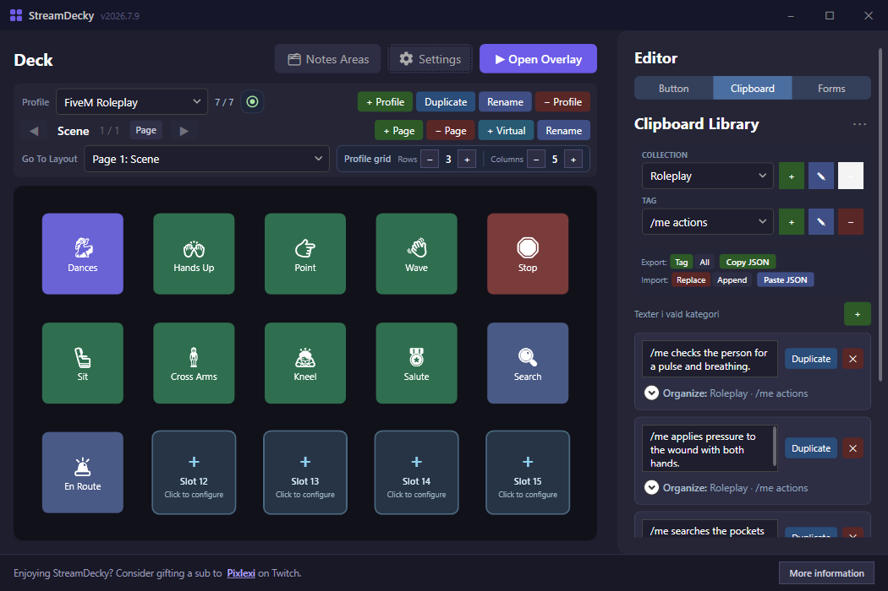
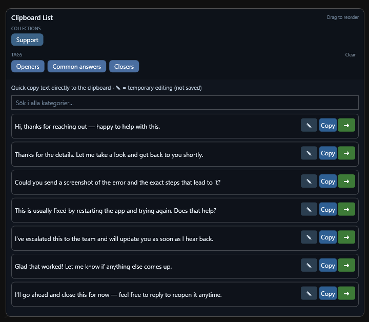

# StreamDecky profile templates

Ready-made profiles you can import and adapt. Each file is a normal StreamDecky
profile export, so importing one adds a new profile next to your own without
touching your existing decks.

## How to import

1. Download the `.json` file you want (open it on the project site and use
   **Save link as…**, or download it from this folder on GitHub).
2. In StreamDecky, open **Settings → Import Profile** and pick the file.
3. The template is added as a new profile. Switch to it from the profile
   selector and edit anything you like — the import never overwrites another
   profile.

Nothing in a template is locked. Buttons, quick-text lines, forms, and colors
are all starting points meant to be changed.

## Templates

### FiveM Roleplay — `fivem-roleplay.json`

A roleplay deck for FiveM and similar chat-command games.

- **Scene page** with one-press emotes (hands up, point, wave, sit, kneel,
  salute, cross arms) plus a **Search** and **En route** action, and a
  **Dances** button that opens a second page of dance/idle emotes with a back
  button.
- **Quick-text** lines grouped into `/me actions`, `/do details`, and `Comms`.
  Clicking a line opens the chat, pastes it, and presses Enter.
- A **Dispatch report** form (call type, location, units, notes) with an
  auto-incrementing case number that copies a formatted MDT entry to the
  clipboard.
- A starter **scene note** for radio channel, plate, and suspect details.

> The emote buttons use `/e <name>` chat commands, which is what most FiveM
> emote resources expect. The exact emote names differ between servers — if a
> button does nothing, open the button in the editor and change the command to
> the name your server uses.

### Canned Replies — `canned-replies.json`

A productivity deck for support, moderation, or any repetitive typing. Because
StreamDecky sends text to whatever window was focused before the overlay
opened, this works in email, help-desk tools, chat apps, and forms.

- **Quick-text** openers, common answers, and closers. Clicking a line pastes
  it straight into the focused text field.
- A **Structured reply** form that composes a full message from a customer
  name, a chosen opening, a free-text body, and your name, with a padded ticket
  number. It copies the finished reply to the clipboard.

## Contributing a template

Export one of your own profiles from **Settings → Export Profile**, strip
anything personal, and open a pull request adding the `.json` file here plus a
short entry above.
